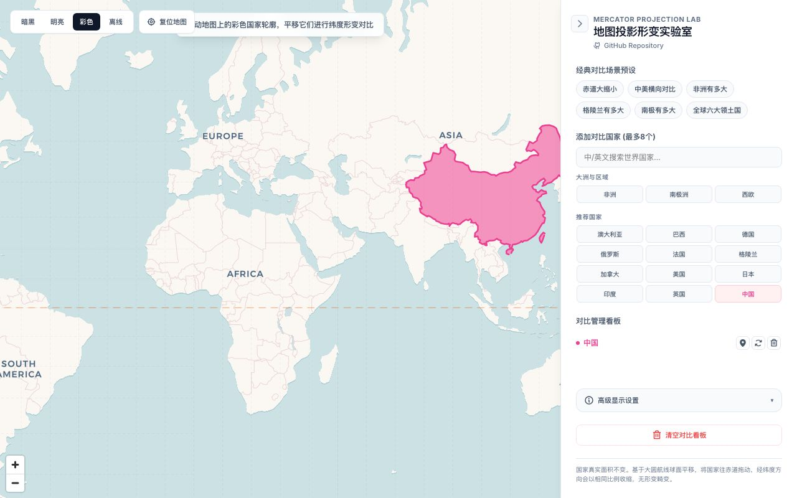

# 地图投影形变实验室 (Mercator Lab)

[English](#english) | [简体中文](#简体中文)

---

## 简体中文

这是一个交互式地图工具，用于直观展示和对比 Web Mercator 投影下各国家与区域的真实几何面积形变。

### 🌟 核心功能
- **球面平移算法**：基于大圆航线（Great-Circle）的球面位移计算，保证国家拖动时经纬双向各向同性收缩，无拉伸形变。
- **双语多语言支持**：支持中/英文界面一键切换，并支持中/英文实时国家搜索。
- **多国独立对比**：支持最多同时添加 8 个对比项，并可独立拖拽、重置或定位。
- **经纬网与赤道参考线**：内置覆盖全球的经纬网辅助网格，并特别高亮了赤道线，直观量化形变倍数。
- **场景预设演示**：内置“赤道大缩小”、“中美对比”、“非洲/格陵兰/南极洲有多大”等一键科学对比演示。

### 📸 项目截图

### 🔗 相关链接
- **GitHub Repository**: [https://github.com/holynova/mercator-country-compare](https://github.com/holynova/mercator-country-compare)
- **在线演示 (GitHub Pages)**: [https://holynova.github.io/mercator-country-compare/](https://holynova.github.io/mercator-country-compare/)

---

## English

An interactive map application to visually demonstrate and compare the true geometric size and projection deformation of countries under the Web Mercator projection.

### 🌟 Features
- **Spherical Translation**: Calculates movement using great-circle routes to ensure isotropic scaling (preserving shapes without stretching) when dragging.
- **Bilingual Interface**: Seamless one-click switching between Chinese and English, supporting search queries in both languages.
- **Multi-Country Comparison**: Compare up to 8 countries or regions side-by-side, each draggable, resettable, and locatable.
- **Graticule & Equator**: Dynamic lat/lng grid lines and highlighted Equator line to quantify area expansion visually.
- **Preset Scenarios**: One-click setups for "Equator Shrink", "US vs. China", and size comparisons of "Africa", "Greenland", and "Antarctica".

### 📸 Screenshot

### 🔗 Links
- **GitHub Repository**: [https://github.com/holynova/mercator-country-compare](https://github.com/holynova/mercator-country-compare)
- **Live Demo (GitHub Pages)**: [https://holynova.github.io/mercator-country-compare/](https://holynova.github.io/mercator-country-compare/)
